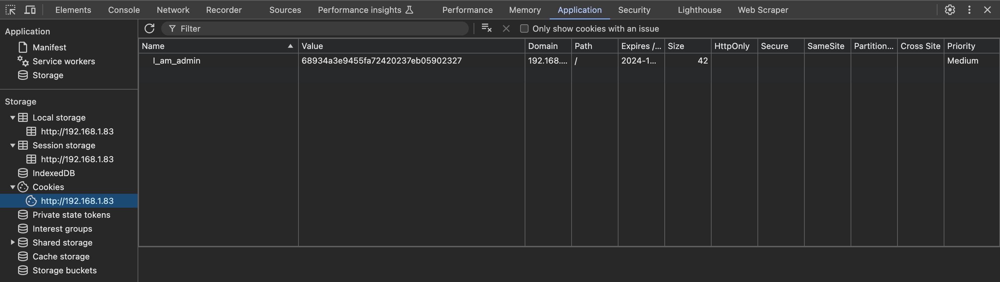
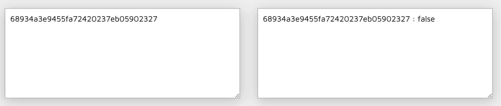
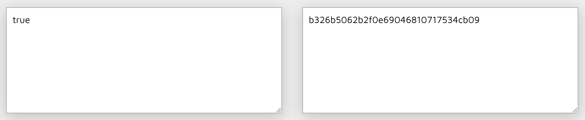
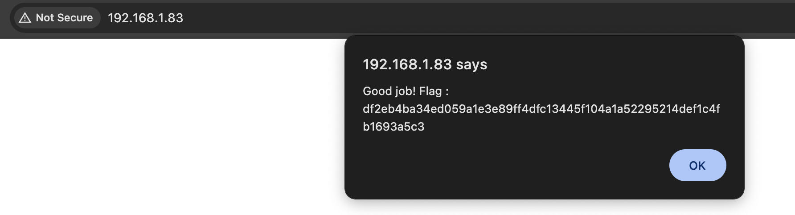

# Cookie weak

## Demonstration

It is required to find the cookie "I_am_admin" through the developer tools

When trying through the service [md5decrypt.net](https://md5decrypt.net/) decode we get the value "false"

Required via the service [md5decrypt.net](https://md5decrypt.net/) encode the text "true"

Insert the received code into the cookie "I_am_admin" and get the flag

## Explanation

Cookies can be easily modified by attackers either in the browser or by implementing client code outside the browser. By changing cookies so that they contain the expected value, attackers can bypass security methods such as authorization and authentication
