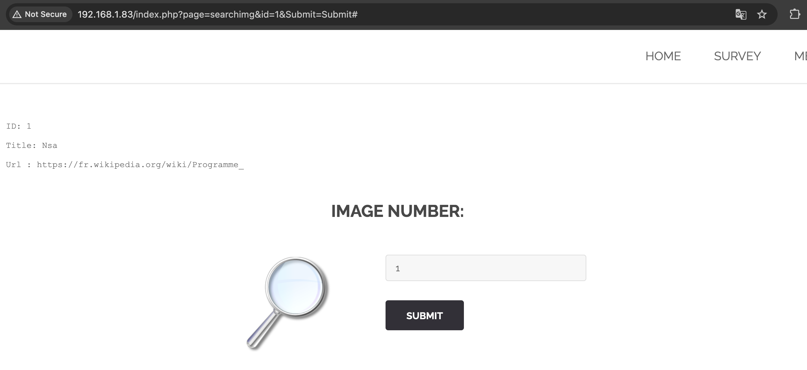
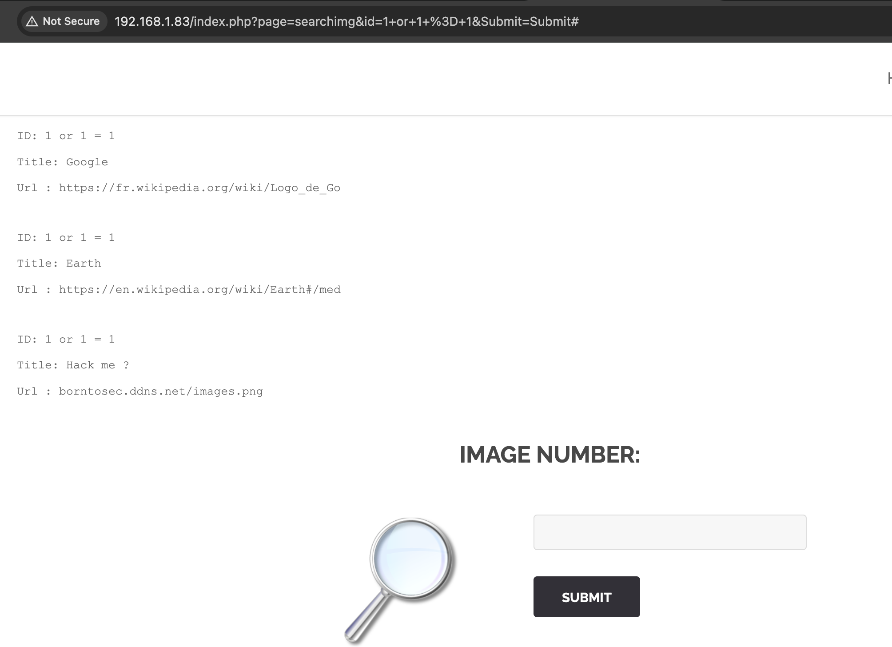
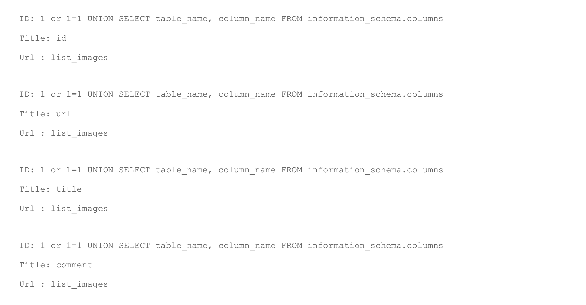
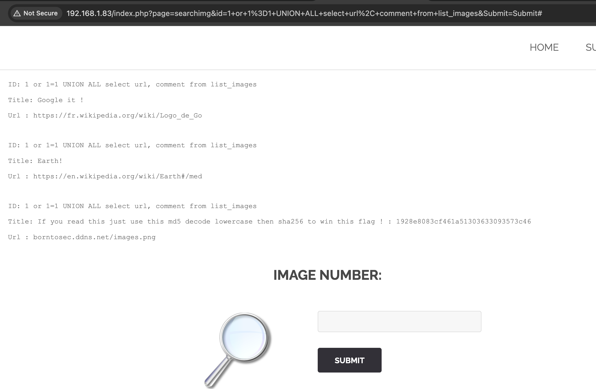

# Image search SQL Injection

## Demonstration

You need to click on the "SEARCH IMAGE" button.
The page opens http://IP_ADDRESS_HOST/?page=searchimg .
The search bar assumes entering the image number, for example, when entering "1", ID, Title, Url are displayed.



If you enter "1 or 1=1", we get a list of all the entries in the table with images.



If you enter "1 or 1=1 UNION SELECT table_name, column_name FROM information_schema.columns", we get a list of all columns and tables in the DB.
We are interested in a table with images.



If you enter "1 or 1=1 UNION select url, comment from list_images", we will get comments for each image.



We are interested in the line that is filled in the Title: "If you read this just use this md5 decode lowercase then sha256 to win this flag! : 1928e8083cf461a51303633093573c46".
Go to the [md5decrypt](https://md5decrypt.net/) and when decoding we get: albatroz.
Then, to get the flag, you need to run the command in the terminal:
```sh
echo -n albatroz | shasum -a 256
f2a29020ef3132e01dd61df97fd33ec8d7fcd1388cc9601e7db691d17d4d6188  -
```

## Explanation

SQL Injection is one of the most common ways to get private information. Attackers are looking for vulnerabilities in the code, if the program does not validate the input request and directly transmits the request to the DB, then data such as password, personal data and other secret data can be obtained.
