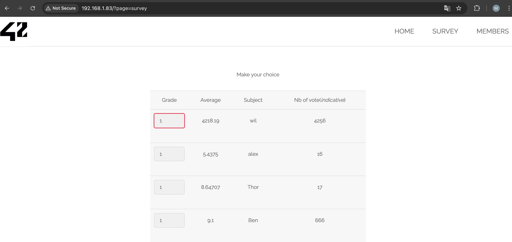
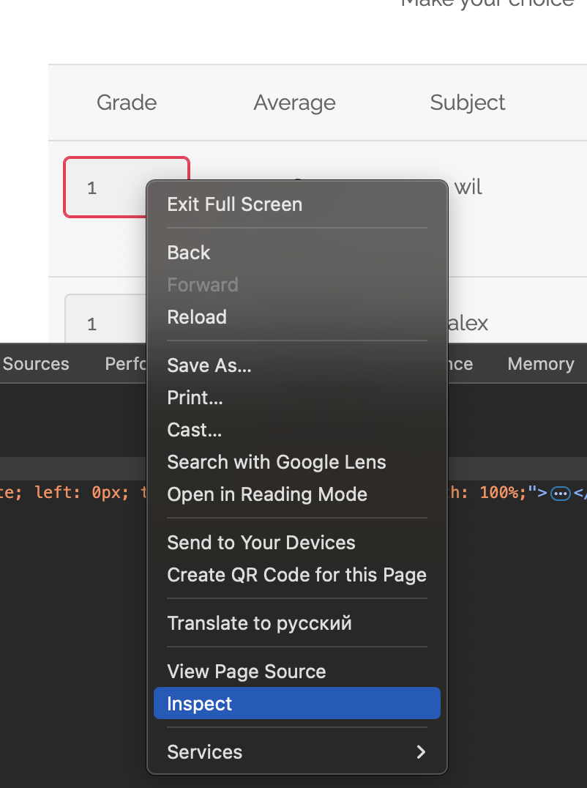
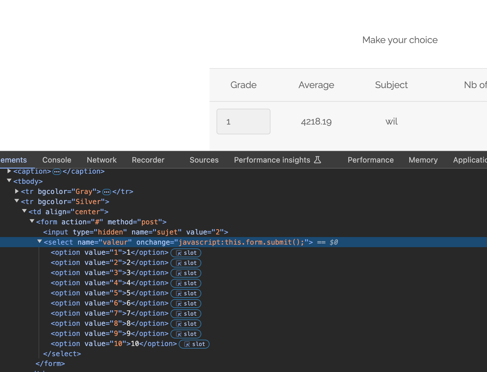
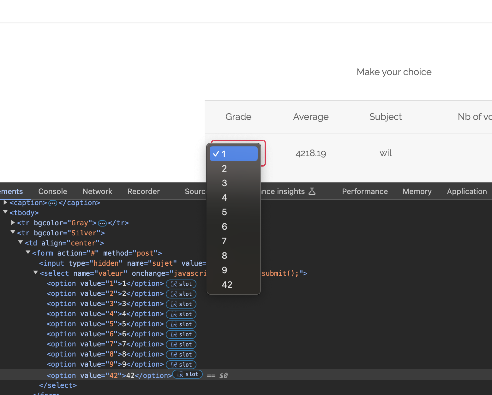
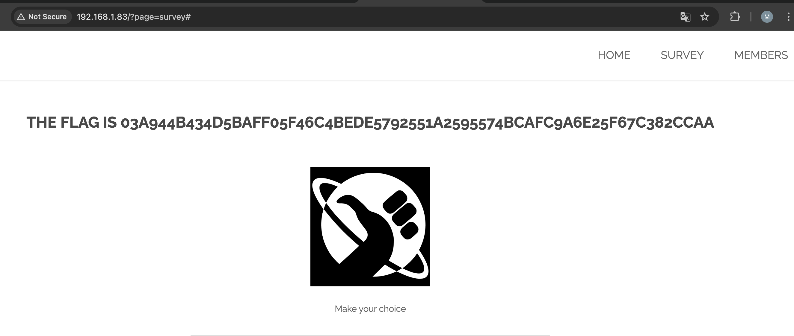

# survey input validation

## Demonstration

On the "Survey" page, which is located at the url: http://IP_ADDRESS_HOST/?page=survey requires a 10-point rating system.

If you go to the developer tools and replace the value of the drop-down list and then select this new value in the user interface, we get a flag

## Explanation
Such exploits are known as an input verification bypass attack or an input verification evasion attack. This term reflects the fact that an attacker can bypass the expected input verification mechanisms in an application by sending values that are not processed properly or are not cleared by the server code.
