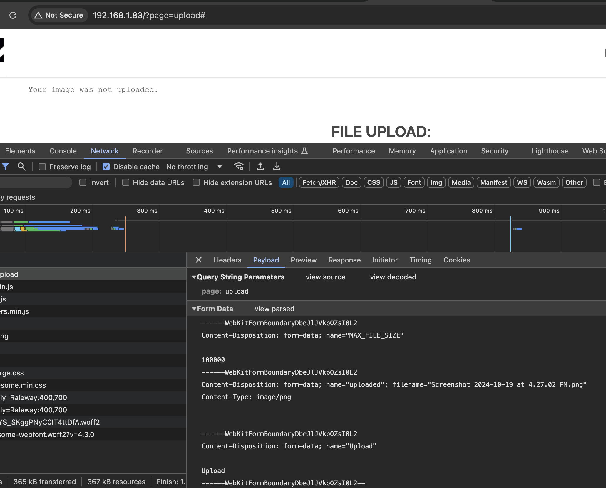
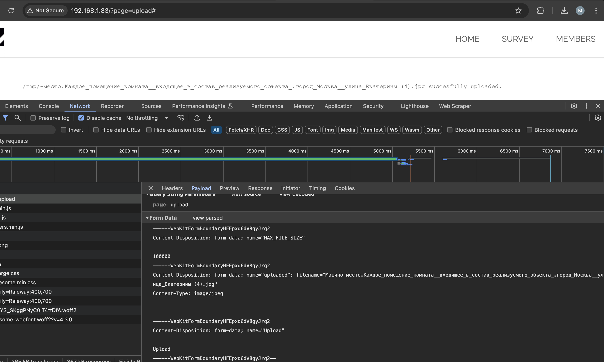
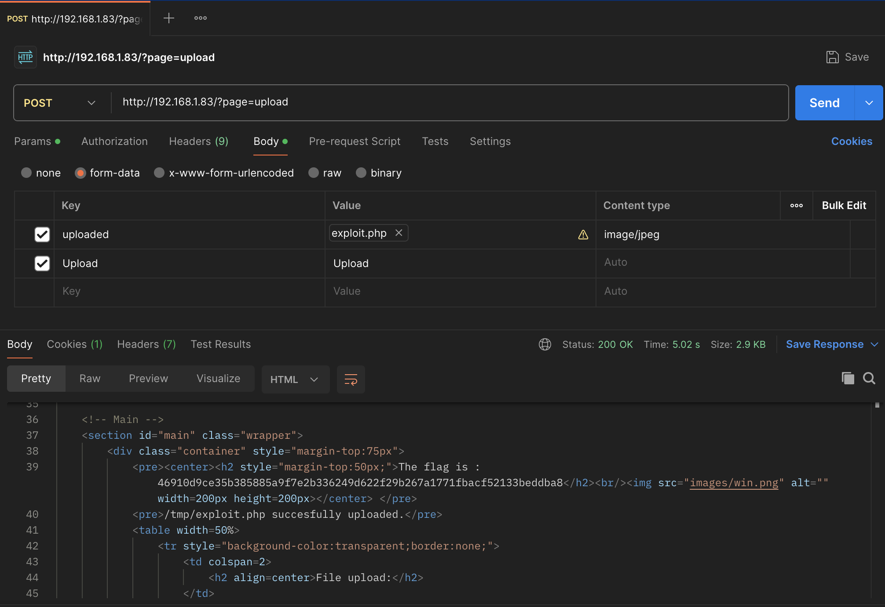
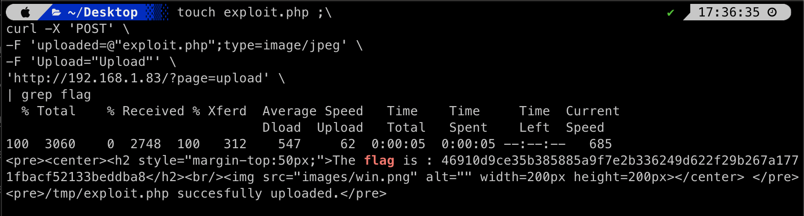

# upload validation

## Demonstration

You need to click on the button "ADD IMAGE". Url address is http://{{IP_HOST}}/?page=upload.
Upload any file.
An error occurs when uploading the wrong file type.



The application accepts only files in the format.jpg or .jpeg. the size is not more than 100KB.



When trying to download a file exploit.php with the substitution of the parameter for "Content-Type: image/jpeg", I received a response with a flag.

Request Example:

```sh
touch exploit.php ;\
curl -X 'POST' \
-F 'uploaded=@"exploit.php";type=image/jpeg' \
-F 'Upload="Upload"' \
'http://{{IP_HOST}}/?page=upload' \
| grep flag

```

or in Postman



Response:



This approach successfully bypasses the server's restrictions on file types, allowing you to execute PHP code under the guise of innocuous image loading.


## Explanation

Vulnerabilities when uploading files and when a web server allows users to upload files to their file system without properly checking parameters such as their name, type, content or size. The lack of proper restrictions on this can lead to the fact that even the basic image upload function can be used to download arbitrary and potentially dangerous files. It may even include server-side script files that allow remote code to be executed.

In some cases, downloading the file itself is enough to cause damage. Other attacks may include a subsequent HTTP request to the file, which is typically launched by the server to execute is.
