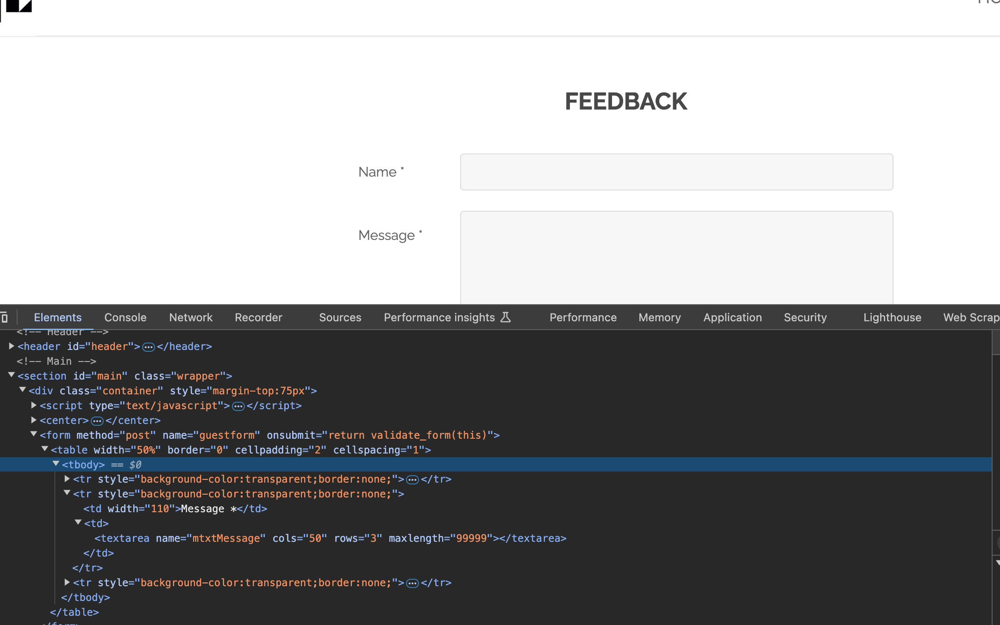
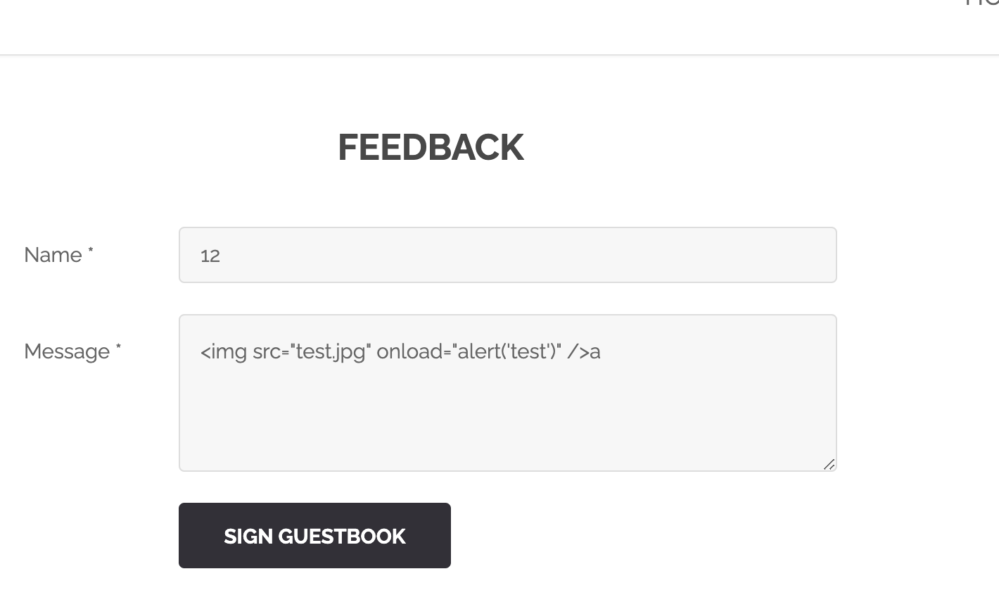
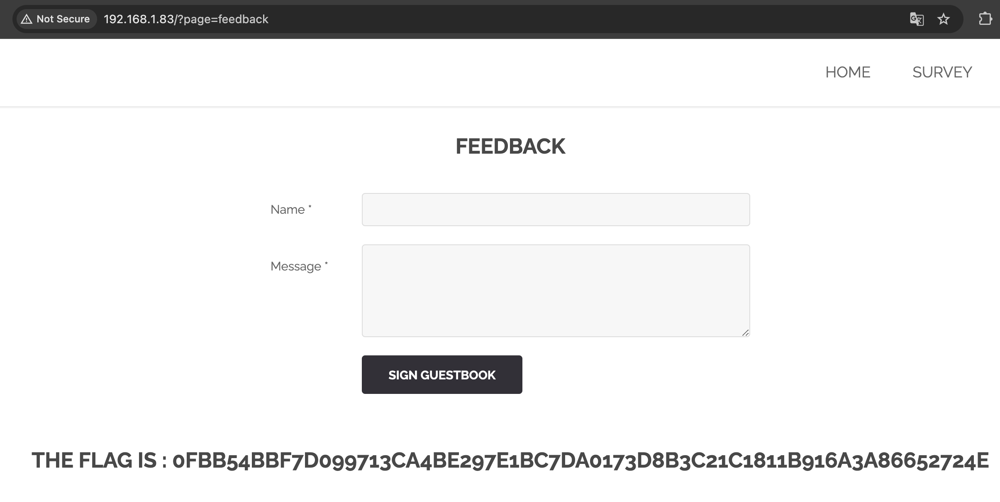

# XSS feedback

## Demonstration

You need to click on the "LEAVE A FEEDBACK" button.
The url page opens: http://{{IP_HOST}}/?page=feedback .
You need to increase the character limit for the Message field in the html of the page.



Add an html tag to the text field with a function, for example alert().

```html
a
```



After filling in and clicking on the button, we get a flag.



## Explanation

[XSS](https://owasp.org/www-community/attacks/xss/)

Cross-site scripting (XSS) attacks are a type of embedding in which malicious scripts are embedded on secure and reliable websites. XSS attacks occur when an attacker uses a web application to send malicious code, usually in the form of a browser-side script, to another end user. The disadvantages that allow these attacks to be successfully carried out are quite common and occur wherever a web application uses user input in the output it generates without verifying or encoding it.
